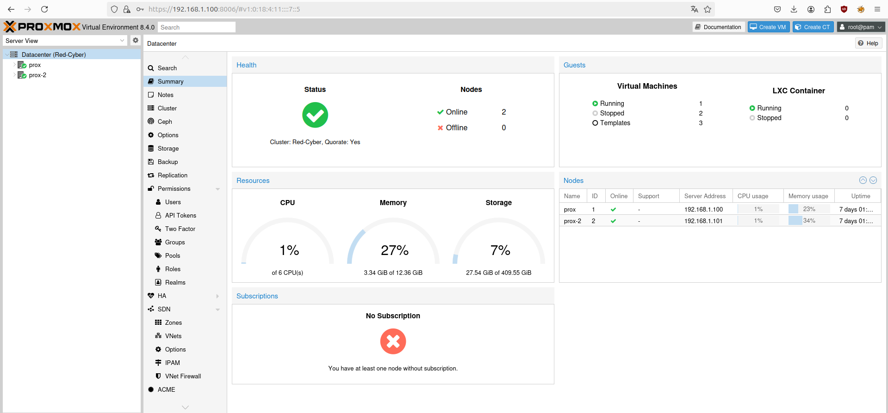

# PoC - Proxmox - Terraform

Automatización de la infraestructura usando **Proxmox**, **Terraform**, **Ansible** y **Jenkins**.  
Este proyecto permite la instalación y configuración de un servidor Proxmox, la provisión de máquinas virtuales mediante Terraform, su configuración automática con Ansible, y la orquestación del proceso completo usando una pipeline de Jenkins.

---

## Estructura del repositorio

```
prox-tf/
├── ansible/        # Playbooks y roles para configuración de VMs
├── imgs/           # Imágenes y capturas usadas en la documentación
├── jenkins/        # Archivos relacionados con la pipeline de Jenkins
├── terraform/      # Código de infraestructura como código para Proxmox
└── README.md       # Documentación del proyecto
```

---

## Requisitos previos

- Un servidor físico con Proxmox VE instalado.
- Acceso al usuario administrador de Proxmox (por IP o dominio).
- Terraform ≥ v1.0
- Ansible ≥ v2.10
- Jenkins instalado y funcionando (puede ser en contenedor, VM o máquina local).
- Acceso a red entre Jenkins, Proxmox y las VMs generadas.
- Claves SSH configuradas para acceso sin contraseña desde Jenkins y/o tu host.

---

## 1. Instalación de Proxmox

> Instalación realizada en un equipo fisico en la red local.

### Pasos:
1. Descargar la ISO de Proxmox desde [proxmox.com](https://www.proxmox.com/en/downloads).
2. Crear un USB booteable o usar una solución virtual.
3. Instalar el sistema y configurar la red básica.
4. Acceder a la interfaz web vía `https://<IP>:8006`.



---

## 2. Configuración de Terraform

> ⚠️ Los archivos del repositorio son de un entorno de pruebas, con parametros por defecto y placeholders.

> Este repositorio utiliza Cloud-Init y plantillas de proxmox para la creación de MV mediante Terraform.


### 2.1 Configuración inicial

```bash
cd terraform/
cp terraform.tfvars.example terraform.tfvars
```

Edita `terraform.tfvars` con tus datos.

### 2.2 Comandos básicos

```bash
terraform init
terraform plan
terraform apply
```


---

## 3. Automatización con Ansible

> El codigo de terraform crea automaticamente el inventario de Ansible, con una configuración correcta solo se tiene que indicar el playbook.


### 3.1 Inventario dinámico o estático

Ejemplo de `example_inventory.ini`:

```ini
[proxmox_vms]
ansible-vm-01 ansible_host=192.168.1.150 ansible_user=ansible ansible_ssh_private_key_file=~/.ssh/id_rsa

[proxmox_vms:vars]
ansible_ssh_common_args='-o StrictHostKeyChecking=no'
ansible_python_interpreter=/usr/bin/python3
```

### 3.2 Ejecución de playbooks

```bash
cd ansible/
ansible-playbook -i example_inventory.ini apache2.yaml
```

El playbook de ejemplo en el repositorio instala apache2 y crea una página web personalizada para su comprobación.

---

## 4. Integración con Jenkins

> ⚠️ En este PoC el pipeline de Jenkins ejecuta todos los pasos desde los archivos locales, para utilizar un repositorio remoto se necesita modificar Jenkinsfile.

### 4.1 Instalación de plugins necesarios

- Git
- Pipeline
- Ansible
- SSH Agent

### 4.2 Pipeline de ejemplo (`jenkins/Jenkinsfile`)

Para la ejecución de los comandos de Terraform se tiene Terraform instalado en el agente, y se ejecuta mediante bash.

```groovy
pipeline {
    agent any

    stages {
        stage('Terraform Init') {
            steps {
                sh 'cd terraform && terraform init'
            }
        }
        stage('Terraform Apply') {
            steps {
                sh 'cd terraform && terraform apply -auto-approve'
            }
        }
        stage('Ansible Config') {
            steps {
                sh 'cd ansible && ansible-playbook -i inventory.ini site.yml'
            }
        }
    }
}
```

### 4.3 Almacén de credenciales

La información sensible en Jenkins se protege mediante el gestor de credenciales propio.


Y permite utilizar estas claves en el plugin de ansible para el acceso mediante clave privada.


### 4.4 Ejecución del pipeline

El pipeline está parametrizado, pudiendo modificar el comportamiento de este junto al numero de MVs que se quieren crear.


En una ejecución exitosa del pipeline se puede crear y/o destruir las MVs.


### 4.5 Accounting del pipeline

Mediante la implementación de parametros y el uso de modulos como "terraform output" se crean artefactos de la ejecución del pipeline y se almacenan para su "accounting".


### 4.6 Validación

La pipeline exitosa pasa el proceso de actualización, planificación, creación, validación y aprovisionamiento mediante ansible.


---

## 5. TODO

> Con el objetivo de aumentar la securización y el funcionamiento del codigo OOTB.

1. Mejorar la integración de Terraform en Jenkins.
    1. Añadir parametros configurables de tfvars.
2. Configurar terraform para utilizar la estructura del repositorio.
3. Convertir Jenkinsfile y la pipeline a un script SCM.

---

## Autores

Miguel Vivas – Joan Lleó  
Proyecto realizado como parte del módulo de puesta en producción segura.